# Teacher + Expert Execution Paths

Scope: teacher and expert features only. The goal of this document is to make code review faster by showing how each feature moves from UI to integration, then into actions/routes, business logic, and database tables.

Status:
- This execution map reflects the current teacher/expert flow after the cleanup pass that addressed the issues recorded in `teacher-expert-ai-pattern-audit.md`.

## Reading Guide

Each feature section includes:
- entry points: page and component surface
- server boundary: server component query, server action, or API route
- business/storage layer
- database tables touched
- notes on where the main review risk concentrates

## Teacher Features

## 1. Dashboard Shell

Entry points:
- `app/[locale]/(dashboard)/dashboard/page.tsx`
- `app/[locale]/(dashboard)/layout.tsx`

What it does:
- renders the teacher's main backend-oriented shell
- shows quick actions, recent surveys, analytics entry points, folder access, and learning-hub access

Flow:
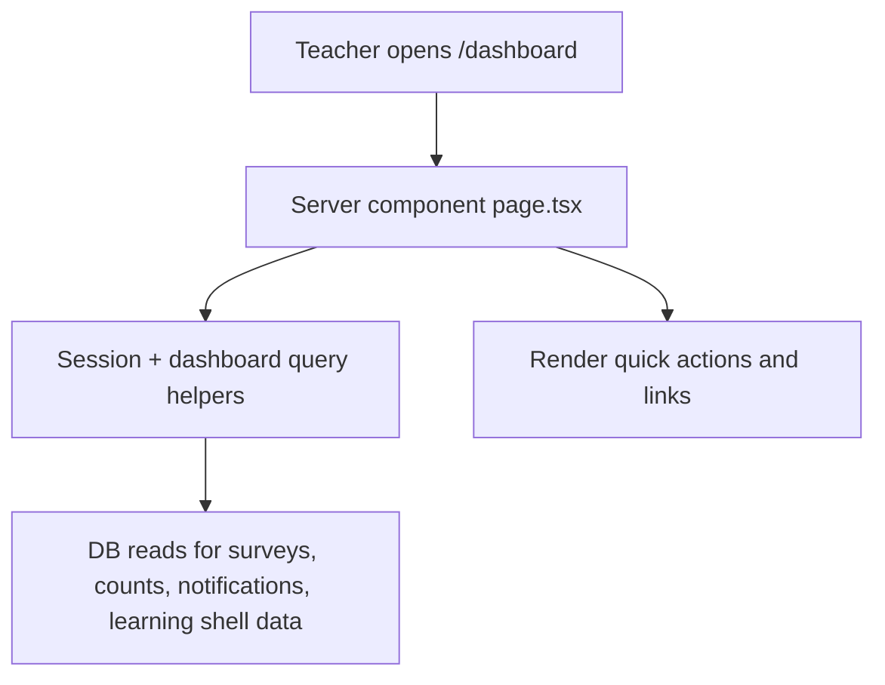

Main server/data path:
- page-level server component fetches dashboard aggregates directly before rendering
- quick actions are plain links, not action-backed buttons

Main tables:
- `surveys` at `db/schema/surveys.ts:87`
- `folders` at `db/schema/folders.ts:8`
- learning shell data eventually comes from:
  - `classrooms` at `db/schema/learning.ts:43`
  - `learningTopics` at `db/schema/learning.ts:129`

Review hotspots:
- link integrity
- stale cache assumptions in counts/widgets

## 2. Survey Authoring

Entry points:
- `app/[locale]/(dashboard)/dashboard/create/page.tsx`
- `components/surveys/pages/create-survey-page-client.tsx`

What it does:
- loads or creates a draft survey
- runs the creation chat flow
- stores extracted planning data as the survey brief is built

Flow:
```mermaid
flowchart TD
  A[/dashboard/create] --> B[create/page.tsx]
  B --> C[getSurveyCreationInitialData + getSurveyDetailsData]
  B --> D[CreateSurveyPageClient]
  D --> E[ensureDraftExists]
  D --> F[/api/surveys/:surveyId/create]
  F --> G[creation orchestration / survey creation logic]
  G --> H[(surveys)]
  G --> I[(survey_creation_conversations)]
  G --> J[(survey_briefs)]
  G --> K[(survey_coverage_plans)]
```

Main integration path:
- client `useChat` transport
- draft bootstrap via `ensureDraftExists`
- request path rewritten to `/api/surveys/${surveyId}/create`

Main tables:
- `surveys` at `db/schema/surveys.ts:87`
- `surveyCreationConversations` at `db/schema/surveys.ts:134`
- `surveyBriefs` at `db/schema/surveys.ts:238`
- `surveyCoveragePlans` at `db/schema/surveys.ts:261`

Important fields:
- `surveys.status`
- `survey_creation_conversations.messages`
- `survey_creation_conversations.extractedData`
- `survey_briefs.brief`
- `survey_coverage_plans.plan`

Review hotspots:
- initial-load failure behavior
- transport path drift
- extracted JSON shape guarantees

## 3. Sample Review and Publish

Entry points:
- `app/[locale]/(dashboard)/dashboard/surveys/[surveyId]/sample-review/page.tsx`
- `components/surveys/pages/sample-review-page-client.tsx`
- `components/surveys/publish-survey-modal.tsx`

What it does:
- replays sample survey conversations
- lets the teacher review whether the agent conducts the survey correctly
- publishes the survey and issues a public URL

Flow:
```mermaid
flowchart TD
  A[Sample review page] --> B[SampleReviewPageClient]
  B --> C[/api/surveys/:surveyId/sample]
  B --> D[publishSurveyAction]
  D --> E[survey lifecycle logic]
  E --> F[(surveys)]
  E --> G[(survey_briefs)]
  E --> H[(survey_coverage_plans)]
  E --> I[(sample_conversations)]
  E --> J[(survey_conducting_profiles)]
```

Key server boundaries:
- sample chat/history routes under `app/api/surveys/[surveyId]/sample/**`
- final publish mutation in `app/actions/survey/survey-lifecycle-actions.ts`

Main tables:
- `sampleConversations` at `db/schema/surveys.ts:165`
- `surveyConductingProfiles` at `db/schema/surveys.ts:422`
- `surveys` at `db/schema/surveys.ts:87`

Important fields:
- `sample_conversations.messages`
- `sample_conversations.confirmed`
- `surveys.shareableLink`
- `surveys.status`
- `surveys.isVoice`

Review hotspots:
- duplicate activation paths
- publish-time data hydration consistency
- sample-to-live profile promotion

## 4. Survey Detail, Settings, and Lifecycle

Entry points:
- `app/[locale]/(dashboard)/dashboard/surveys/[surveyId]/page.tsx`
- `components/surveys/pages/survey-detail-page-client.tsx`

What it does:
- displays survey configuration, share state, response status, and lifecycle controls
- supports pause/reactivate/delete and custom slug operations

Flow:
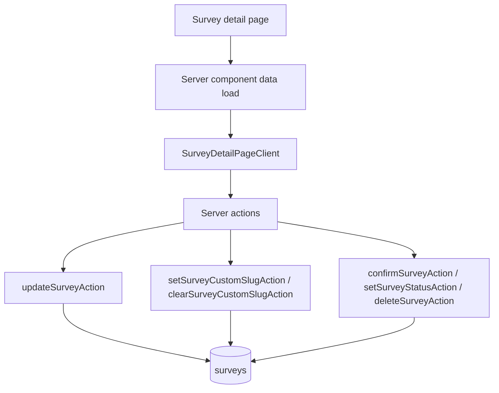

Main tables:
- `surveys`
- folder linkage through `surveys.folderId`

Important fields:
- `title`, `description`, `shareableLink`, `customSlug`, `status`, `participantLimit`, `isVoice`

Review hotspots:
- mutation/caching consistency
- lifecycle duplication with sample review
- capability enforcement through survey permission helpers

## 5. Survey Analytics and Response Review

Entry points:
- `app/[locale]/(dashboard)/dashboard/surveys/[surveyId]/analytics/page.tsx`
- `app/[locale]/(dashboard)/dashboard/surveys/[surveyId]/responses/[responseId]/page.tsx`

What it does:
- loads analytics summaries
- loads individual response detail
- supports analytics refresh and analytics chat

Flow:
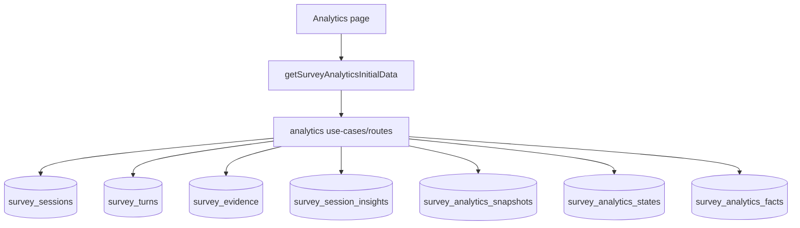

Main tables:
- `surveySessions` at `db/schema/surveys.ts:279`
- `surveyTurns` at `db/schema/surveys.ts:307`
- `surveyEvidence` at `db/schema/surveys.ts:330`
- `surveySessionInsights` at `db/schema/surveys.ts:358`
- `surveyAnalyticsSnapshots` at `db/schema/surveys.ts:523`
- `surveyAnalyticsStates` at `db/schema/surveys.ts:541`
- `surveyAnalyticsFacts` at `db/schema/surveys.ts:555`

Review hotspots:
- analytics recomputation invalidation
- consistency between raw sessions and snapshot/fact tables

## 6. Folder Management

Entry points:
- `app/[locale]/(dashboard)/dashboard/folders/page.tsx`
- `app/[locale]/(dashboard)/dashboard/folders/[folderId]/page.tsx`

What it does:
- organizes teacher-owned surveys into folders

Flow:
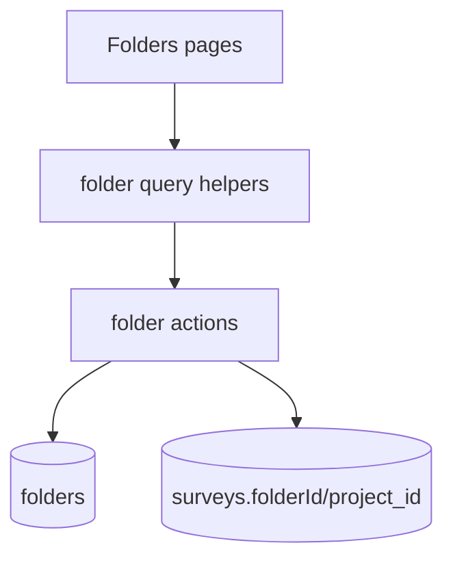

Main tables:
- `folders` at `db/schema/folders.ts:8`
- `surveys.folderId` backed by DB column `project_id`

Review hotspots:
- folder/survey ownership consistency
- naming drift between code field and DB column

## 7. Learning Hub: Classroom Management

Entry points:
- `app/[locale]/(dashboard)/dashboard/learning/page.tsx`
- `components/learning/learning-hub.tsx`
- `components/learning/teacher-learning-home.tsx`
- `components/learning/hooks/use-teacher-learning-workspace.ts`

What it does:
- presents the teacher workspace for classrooms, topics, students, and interventions
- reads classroom lists and related hub data

Flow:
```mermaid
flowchart TD
  A[/dashboard/learning] --> B[learning/page.tsx]
  B --> C[server query bootstrap]
  C --> D[LearningHub / TeacherLearningHome]
  D --> E[lib/api/learning.ts fetch layer]
  E --> F[/api/learning/classrooms and related GET routes]
  F --> G[query/service layer]
  G --> H[(classrooms)]
  G --> I[(classroom_students)]
  G --> J[(learning_topics)]
  G --> K[(learning_interventions)]
```

Main tables:
- `classrooms` at `db/schema/learning.ts:43`
- `classroomStudents` at `db/schema/learning.ts:65`
- `learningTopics` at `db/schema/learning.ts:129`
- `learningInterventions` at `db/schema/learning.ts:666`

Important fields:
- `classrooms.teacherUserId`
- `classroom_students.inviteStatus`
- `classroom_students.onboardingStatus`
- `learning_topics.status`

Review hotspots:
- auth guard quality on teacher mutations
- consistency between list queries and action invalidation

## 8. Invitations and Student Enrollment

Entry points:
- learning hub student-management UI
- classroom invitation actions

What it does:
- teacher invites students individually or in bulk
- student acceptance later binds app user to `classroom_students`

Flow:
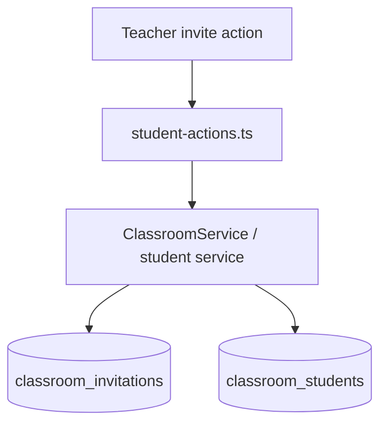

Main tables:
- `classroomInvitations` at `db/schema/learning.ts:94`
- `classroomStudents` at `db/schema/learning.ts:65`

Important fields:
- `invitedEmail`, `status`, `expiresAt`, `acceptedByUserId`
- `classroom_students.userId`

Review hotspots:
- teacher ownership checks
- acceptance idempotency
- invitation/member record synchronization

## 9. Topic Management, Materials, Questions, and Reports

Entry points:
- topic creation forms in learning hub
- `app/[locale]/(dashboard)/dashboard/learning/topics/[topicId]/page.tsx`

What it does:
- creates learning topics
- manages supporting materials
- exposes readiness/questions/report views for teacher review

Flow:
```mermaid
flowchart TD
  A[Teacher topic UI] --> B[createLearningTopicAction / updateTopicStatusAction]
  B --> C[ClassroomService / topic-service]
  C --> D[(learning_topics)]
  A --> E[/api/learning/topics/:topicId/materials]
  A --> F[/api/learning/topics/:topicId/questions]
  A --> G[/api/learning/topics/:topicId/reports]
  E --> H[(topic_materials)]
  F --> I[(learning_interactions and topic context)]
  G --> J[(student_progress_reports)]
```

Main tables:
- `learningTopics` at `db/schema/learning.ts:129`
- `topicMaterials` at `db/schema/learning.ts:168`
- `studentProgressReports` at `db/schema/learning.ts:528`

Important fields:
- `sourceBoundary`
- `learningOutcomes`
- `extractionStatus`, `indexingStatus`, `analysis`

Review hotspots:
- JSON validation on topic creation
- material extraction/indexing status handling
- teacher/student id naming clarity in topic-question requests

## 10. Student Detail and Teacher Copilot Chat

Entry points:
- `app/[locale]/(dashboard)/dashboard/learning/students/[studentId]/page.tsx`
- `components/learning/teacher-student-detail-page.tsx`
- `components/learning/teacher-student-chat.tsx`

What it does:
- shows a teacher-facing view of one classroom student
- loads patterns, sessions, and report context
- lets the teacher ask grounded questions against the student’s evidence

Flow:
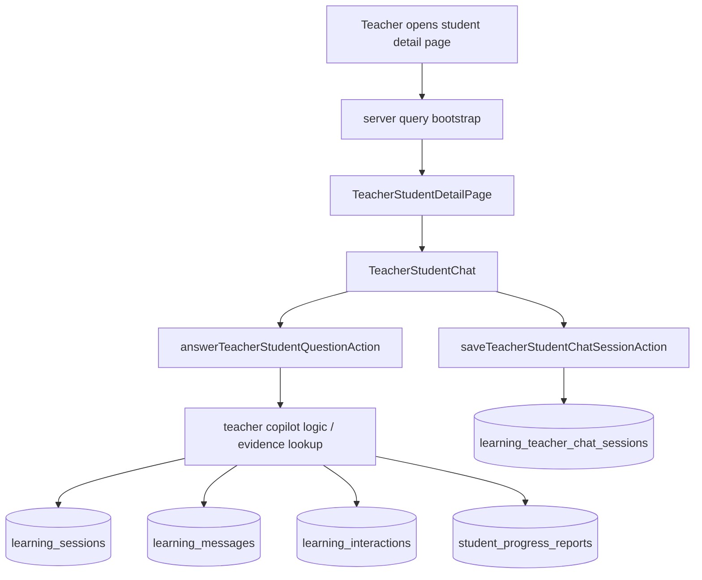

Main tables:
- `teacherStudentChatSessions` at `db/schema/learning.ts:457`
- `learningSessions` at `db/schema/learning.ts:229`
- `learningMessages` at `db/schema/learning.ts:481`
- `learningInteractions` at `db/schema/learning.ts:496`

Important fields:
- `learning_teacher_chat_sessions.messages`
- `learning_interactions.role`
- `student_progress_reports.report`

Review hotspots:
- persistence after answer generation
- loose message-parts typing
- evidence completeness in teacher answers

## 11. Interventions

Entry points:
- learning hub intervention UI
- student/topic detail pages with intervention affordances

What it does:
- teachers log and update interventions tied to a classroom student and optionally a topic

Flow:
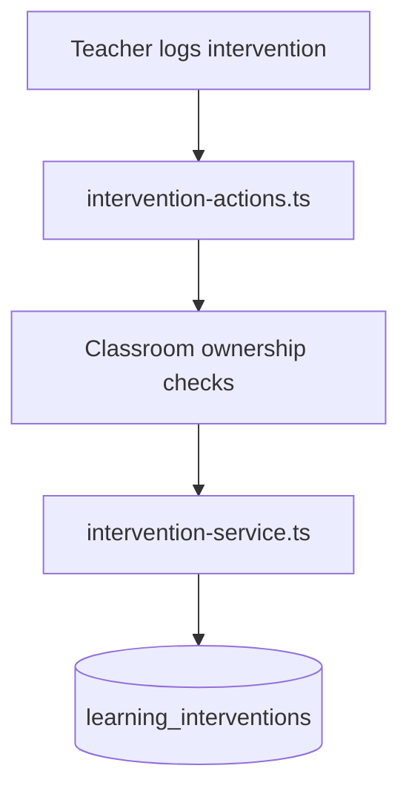

Main table:
- `learningInterventions` at `db/schema/learning.ts:666`

Important fields:
- `classroomId`
- `classroomStudentId`
- `topicId`
- intervention metadata fields

Review hotspots:
- student/topic-to-classroom consistency
- ownership checks on update

## Expert Features

## 1. Expert Access Gate

Entry points:
- `app/[locale]/expert/layout.tsx`
- `lib/learning/expert-route-guard.ts`

What it does:
- blocks the expert area to non-expert users
- routes server pages and API routes through expert-session checks

Flow:
```mermaid
flowchart TD
  A[/expert/*] --> B[expert/layout.tsx]
  B --> C[require expert session for pages]
  A2[/api/learning/expert/*] --> D[requireExpertSession]
```

Review hotspot:
- confirm all expert mutation/read routes go through the same server-side gate

## 2. AI Ops Guidance Packs

Entry points:
- `app/[locale]/expert/ai-ops/page.tsx`
- `components/expert/expert-ai-ops-console.tsx`

What it does:
- lists guidance packs and versions
- creates packs
- creates new versions
- activates versions

Flow:
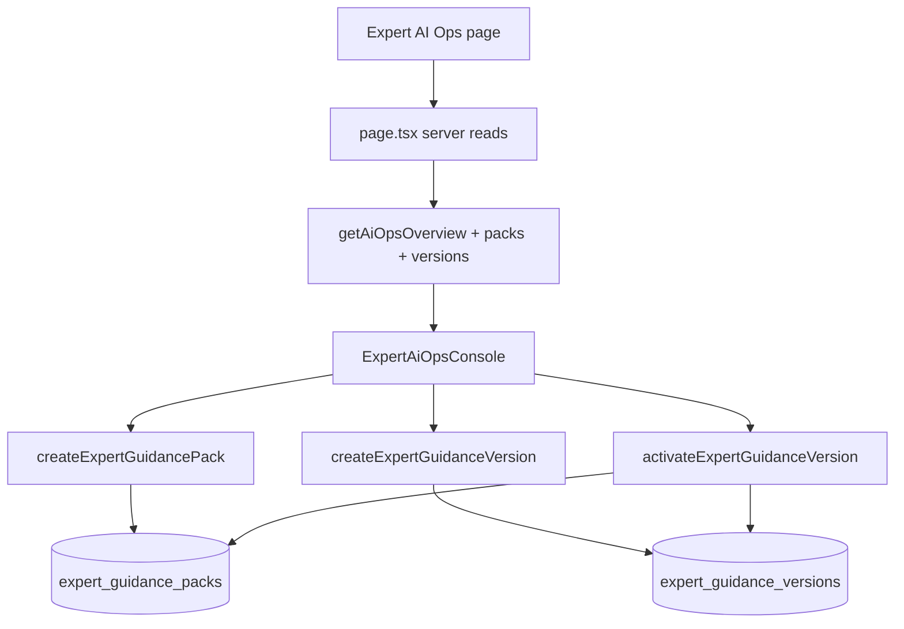

Main tables:
- `expertGuidancePacks` at `db/schema/ai.ts:17`
- `expertGuidanceVersions` at `db/schema/ai.ts:45`

Important fields:
- `feature`
- `artifactType`
- `status`
- `activeVersionId`
- `artifact`

Review hotspots:
- N+1 reads on page load
- activation atomicity
- JSON artifact validation quality

## 3. Few-Shot Example Authoring and Retrieval

Entry points:
- `app/[locale]/expert/few-shot/page.tsx`
- `components/expert/few-shot-manager.tsx`

What it does:
- lets experts author few-shot examples
- stores them for later retrieval in runtime prompting

Flow:
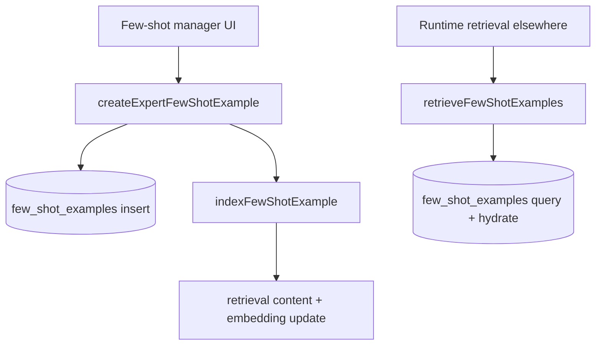

Main table:
- `fewShotExamples` at `db/schema/ai.ts:74`

Important fields:
- `feature`
- `tags`
- `retrievalContent`
- `content`
- `embedding`

Review hotspots:
- partial success between insert and indexing
- retrieval fallback masking operational faults
- JSON shape validation

## 4. Framework Library

Entry points:
- `app/[locale]/expert/frameworks/page.tsx`
- framework library studio component

What it does:
- lists or creates expert frameworks associated with topics/classrooms

Flow:
```mermaid
flowchart TD
  A[Framework library page] --> B[framework library client]
  B --> C[/api/learning/expert/frameworks]
  C --> D[(expert_frameworks)]
```

Main table:
- `expertFrameworks` at `db/schema/learning.ts:558`

Important fields:
- `classroomId`
- `topicId`
- `activeVersionId`
- `archivedAt`

Review hotspots:
- topic/framework ownership linkage
- meaning of global vs topic-scoped framework operations

## 5. Framework Version Drafting and Activation

Entry points:
- `app/[locale]/expert/frameworks/[id]/versions/page.tsx`
- `components/expert/expert-framework-version-studio.tsx`
- `app/api/learning/expert/frameworks/[frameworkId]/versions/route.ts`
- `app/api/learning/expert/frameworks/[frameworkId]/activate/route.ts`

What it does:
- drafts versioned framework artifacts
- publishes one version as active
- generates runtime model state from the active framework

Flow:
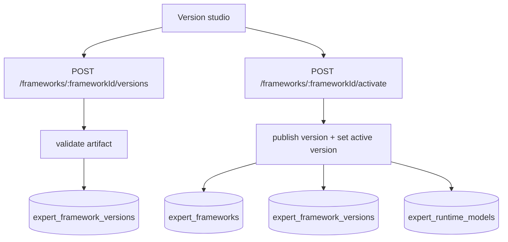

Main tables:
- `expertFrameworkVersions` at `db/schema/learning.ts:583`
- `expertRuntimeModels` at `db/schema/learning.ts:787`

Important fields:
- `version`
- `status`
- `framework`
- `publishedAt`
- `frameworks.activeVersionId`

Review hotspots:
- version-number race
- activation transaction boundaries
- artifact-schema compatibility with runtime engine

## 6. Runtime Preview

Entry points:
- `app/[locale]/expert/runtime-preview/page.tsx`
- `components/expert/expert-runtime-preview.tsx`
- `app/api/learning/expert/frameworks/preview/route.ts`

What it does:
- previews a generated question for a topic before publishing a framework version

Flow:
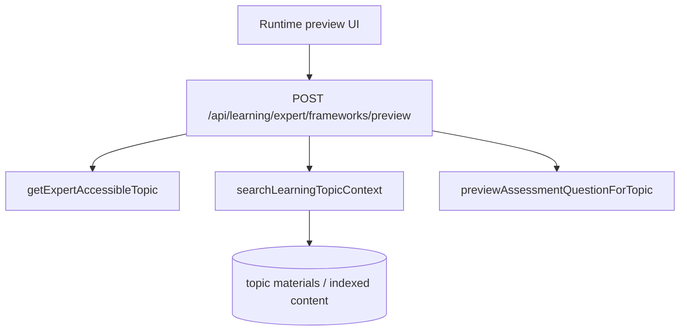

Review hotspots:
- dependency on topic retrieval/index completeness
- preview parameter validation

## 7. QA Review Queue, Transcript Review, and Annotation Creation

Entry points:
- `app/[locale]/expert/qa/page.tsx`
- `components/expert/expert-qa-review.tsx`
- `app/api/learning/expert/review-queue/route.ts`
- `app/api/learning/expert/sessions/[sessionId]/transcript/route.ts`
- `app/api/learning/expert/annotations/route.ts`

What it does:
- shows sessions needing expert review
- loads transcript history
- lets the expert record a structured correction

Flow:
```mermaid
flowchart TD
  A[Expert QA page] --> B[/expert/review-queue]
  A --> C[/expert/sessions/:sessionId/transcript]
  A --> D[/expert/annotations]
  B --> E[listExpertReviewQueue]
  C --> F[listLearningMessages]
  D --> G[create review case]
  G --> H[(expert_review_cases)]
  G --> I[maybe create draft crystallization]
  I --> J[(expert_crystallizations)]
```

Main tables:
- `expertReviewCases` at `db/schema/learning.ts:617`
- `expertCrystallizations` at `db/schema/learning.ts:705`
- transcript source tables:
  - `learningSessions`
  - `learningMessages`
  - `learningInteractions`

Important fields:
- `reviewType`
- `priority`
- `tutorFailureSummary`
- `expertCorrection`
- `relevanceScope`
- `reusableSignal`

Review hotspots:
- transcript/evidence completeness
- annotation validation
- duplicate-review prevention

## 8. Knowledge Inbox and Crystallization Approval

Entry points:
- `app/[locale]/expert/knowledge/page.tsx`
- `app/actions/expert-knowledge.ts`

What it does:
- lists draft crystallizations
- expert approves or archives them
- approved heuristics later influence runtime generation

Flow:
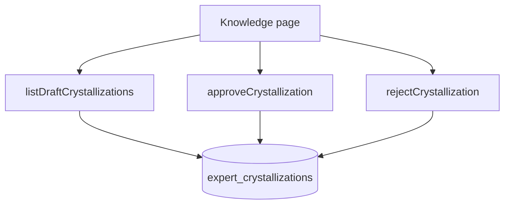

Review hotspots:
- runtime validation on approval input
- auditability of heuristic edits before approval

## 9. Runtime Models and Evals

Entry points:
- `app/[locale]/expert/runtime-models/page.tsx`
- `app/[locale]/expert/evals/page.tsx`

What they do:
- runtime models page is mainly a read surface over generated runtime state
- evals page is a shell into expert evaluation tooling

Main table:
- `expertRuntimeModels` at `db/schema/learning.ts:787`

Important fields:
- runtime model payload
- framework version linkage
- topic/classroom linkage

Review hotspots:
- consistency between active framework version and stored runtime model

## Cross-Cutting Tables

These tables appear in multiple teacher/expert flows and should be reviewed once, centrally:

- `surveys` at `db/schema/surveys.ts:87`
  - teacher survey lifecycle anchor
- `learningTopics` at `db/schema/learning.ts:129`
  - teacher topic anchor and expert framework/topic anchor
- `learningSessions` at `db/schema/learning.ts:229`
  - student tutoring execution history that experts later inspect
- `learningMessages` at `db/schema/learning.ts:481`
  - transcript source
- `learningInteractions` at `db/schema/learning.ts:496`
  - evidence/events used in reports and expert review
- `teacherStudentChatSessions` at `db/schema/learning.ts:457`
  - teacher copilot persistence
- `expertFrameworkVersions` at `db/schema/learning.ts:583`
  - expert-authored pedagogy artifact versions
- `expertReviewCases` at `db/schema/learning.ts:617`
  - expert correction corpus
- `expertCrystallizations` at `db/schema/learning.ts:705`
  - distilled reusable heuristics
- `expertGuidancePacks` and `expertGuidanceVersions` at `db/schema/ai.ts:17` and `:45`
  - AI Ops guidance layer
- `fewShotExamples` at `db/schema/ai.ts:74`
  - expert-authored retrieval examples

## Review Order Suggestion

If you want the fastest path to high-signal human review:

1. Survey publish lifecycle
2. Classroom creation and teacher auth boundaries
3. Topic creation validation
4. Teacher copilot chat persistence
5. Few-shot create/retrieve path
6. Framework version draft/activate path
7. Expert QA review and crystallization path
