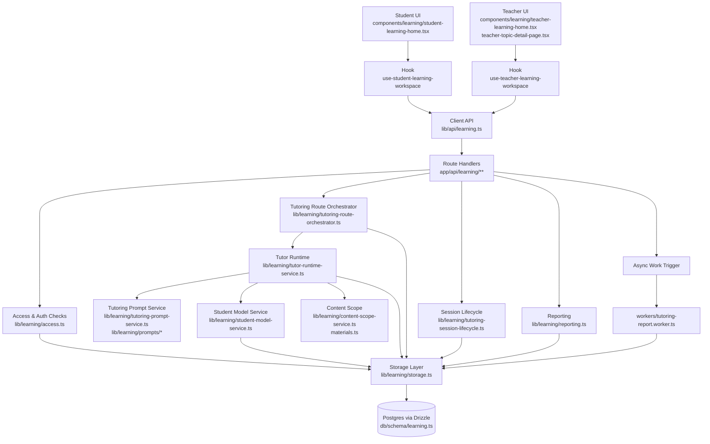
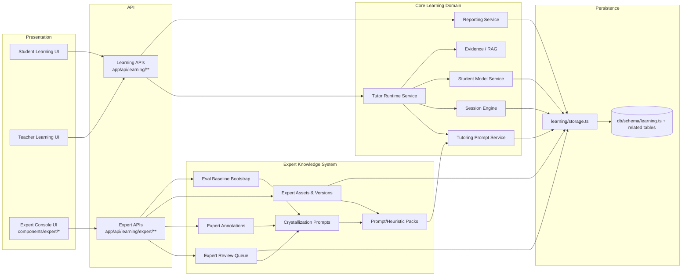

# Tutoring Feature Data Flow & Architecture

This document complements `docs/tutoring-feature-file-inventory.md` with two system diagrams:
1) end-to-end data flow from UI to database, and
2) architecture with emphasis on expert-knowledge integration.

## 1) End-to-End Data Flow (UI → API → Domain Services → DB)

### Notes
- Student tutoring turns originate in the student workspace UI and hit `/api/learning/topics/[topicId]/chat`.
- Teacher analytics/report views originate in teacher workspace components and hit reports/overview/pattern endpoints.
- Domain services centralize prompt/runtime/session orchestration before persistence.

## 2) Architecture Diagram (with Expert Integration Focus)

### How expertise is integrated into tutoring behavior
1. **Experts review real tutoring transcripts/interactions** via expert endpoints and UI queue tools.
2. **Experts annotate failures/corrections** and curate improved pedagogical guidance.
3. **Crystallization transforms reviewed feedback into reusable heuristics/prompt assets**.
4. **Versioned expert assets are activated** and made available to tutoring prompt assembly.
5. **Tutor runtime consumes updated prompt packs** in subsequent student sessions, changing live tutoring behavior.

## Source map for diagram nodes
- Student/Teacher UI: `components/learning/*`, `components/learning/hooks/*`
- Expert UI: `components/expert/*`
- Learning APIs: `app/api/learning/**`
- Expert APIs: `app/api/learning/expert/**`
- Core services: `lib/learning/tutor-runtime-service.ts`, `lib/learning/tutoring-prompt-service.ts`, `lib/learning/session-engine.ts`, `lib/learning/student-model-service.ts`, `lib/learning/rag.ts`, `lib/learning/reporting.ts`
- Persistence: `lib/learning/storage.ts`, `db/schema/learning.ts`
- Async: `workers/tutoring-report.worker.ts`
